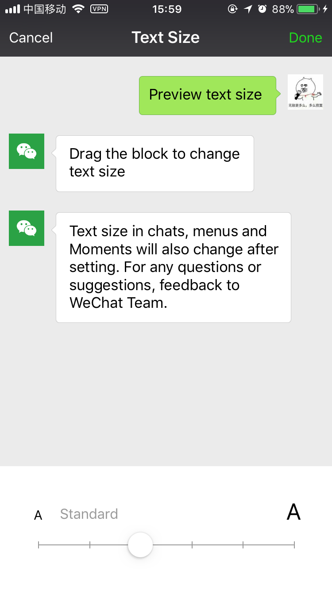
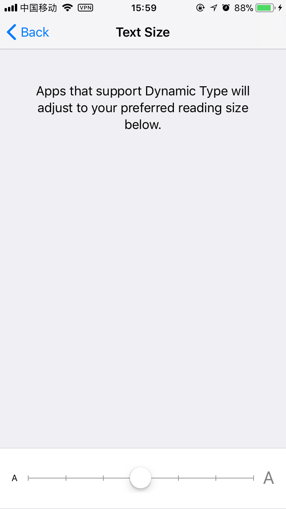
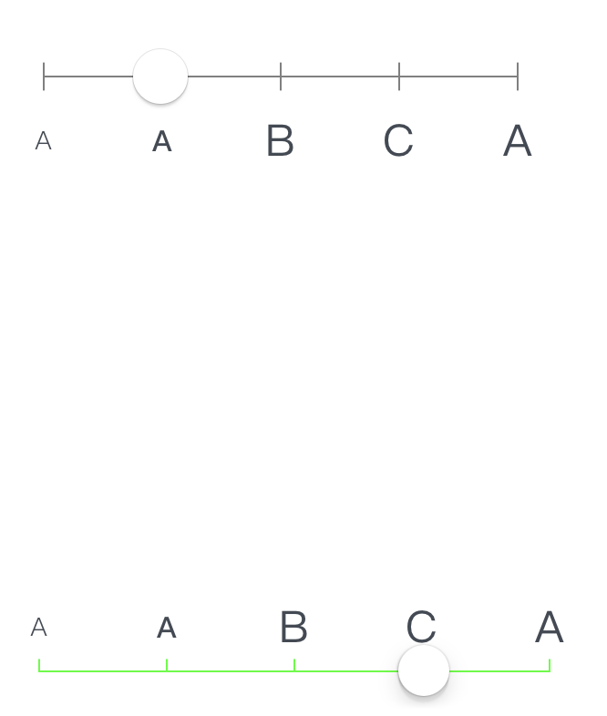

# FTScaleSliderView

带刻度的Slider

> 由于项目中有一个需求需要根据slider的数值来调整字体大小,效果类似苹果系统的字体大小调节和微信的:

经过观察后发现,苹果系统的字体调节滑块是不能响应点击事件,而微信的是可以的,我们的需求也是可以点击的,但是网上找了一个,有个人写了一个防微信字体调节的控件,但是滑块下面的刻度条竟然是用图片来做的,看图片前缀好像真是微信的包里提取出来的.但是用图片就使得控制完全丧失了自定义的能力. 所以最终还是决定自己亲自操刀写一个.

最终效果如下:

#### 支持的自定义选项
1. 刻度条样式
	- 穿透
	- 只显示上半部分
	- 只显示下半部分
2. 刻度条颜色
3. 标题位置
	- 刻度条上面
	- 刻度条下面
4. 标题富文本
5. 是否响应点击选择
6. 滑块自定义图片

